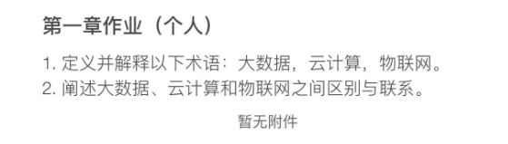

## Homework 1

### Q1

1. **大数据(Big data)** 指数据集合的体积非常庞大且复杂，传统的数据处理应用软件难以有效处理的数据 大数据涉及从多种来源收集、存储、分析和管理的数据，通常包括结构化数据、半结构化数据和非结构化数据。这些数据的特点可以用“四V”来描述：体量巨大（Volume）、多样性（Variety）、高速生成（Velocity）和价值密度低（Veracity）。 
2. **云计算(Cloud Computing)**云计算是一种基于互联网的计算方式，通过网络提供共享的计算资源和数据到计算机和其他设备上 用户可以按需获取如存储、服务器、数据库、网络、软件等计算资源，无需直接管理物理服务器。主要服务模式包括基础设施即服务（IaaS）、平台即服务（PaaS）和软件即服务（SaaS）。 
3. **物联网(Internet of Things, IoT)** 物联网是指通过互联网将物理设备相互连接的网络 这些设备（如传感器、智能设备等）能够收集和交换数据，使得我们能够远程监控和控制它们。物联网的应用十分广泛，包括智能家居、智慧城市、健康监测等领域。 

### Q2

**区别**：

- **大数据**侧重于数据的规模和处理。它主要关注数据的分析、存储和处理，尤其是在处理非常大或复杂的数据集时。
- **云计算**侧重于提供灵活的计算资源。它使用户能够通过互联网访问并使用存储和计算能力，而无需担心底层硬件的维护和升级。
- **物联网**侧重于设备的互联和数据的收集。它涉及到将日常物品通过传感器、软件等方式连接到互联网，以实现智能化和自动化的目的。

**联系**：

- **物联网设备**产生大量数据，这些数据通常被存储在**云端**，并使用**大数据技术**进行处理和分析，以提取有用的信息和知识。例如，物联网设备在智能家居中收集的数据（如温度、湿度、使用习惯等）可以存储在云服务器上，并用大数据技术进行分析，以优化能源使用和提高居住舒适度。
- 云计算为物联网和大数据提供了必要的计算资源和平台支持。例如，云平台可以提供动态扩展的能力来应对物联网设备在特定时间点大量产生的数据。
- 大数据技术的发展推动了云计算和物联网的效率和能力，使得数据的收集、存储和分析更为高效和有价值。