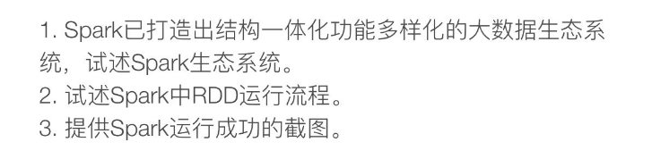
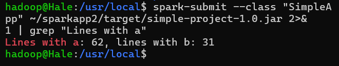

# homework 10

## Q1

Apache Spark已经发展成为一个结构一体化、功能多样化的大数据处理平台，其生态系统包括多个关键组件，这些组件共同支持了从批处理到实时流处理的多种数据处理需求。以下是Spark生态系统的详细介绍：

### 1. **核心 Spark**

核心Spark提供了基础的API功能，包括Spark RDD（弹性分布式数据集）的创建和操作。它是建立其他功能模块的基础，支持高级别的数据抽象和集群中的分布式任务执行。

### 2. **Spark SQL**

Spark SQL 是 Spark 处理结构化数据的模块。通过它，用户可以使用 SQL 或者 Apache Hive版本的SQL（称为HQL）来查询数据。Spark SQL同时支持SQL语句直接运行查询任务，或者将SQL查询与Spark程序代码（如使用RDD操作）混合使用。它允许开发者以数据框（DataFrame）和数据集（Dataset）的形式处理数据，这些数据结构提供了比RDD更高级的数据抽象。

### 3. **Spark Streaming**

Spark Streaming 是 Spark 的实时数据流处理工具，可以让用户实现实时数据分析。它的数据处理模型基于高效的“微批处理”架构，数据被划分为小批量处理，实现近乎实时的处理速度。Spark Streaming 支持多种数据源，包括 Kafka、Flume 和简单的 TCP 套接字等。

### 4. **MLlib（机器学习库）**

MLlib是Spark中用于机器学习的库。它包含多种常用的机器学习算法和功能，如分类、回归、聚类、协同过滤、降维等，同时提供了模型评估、数据导入等工具。MLlib使得机器学习变得易于实现，并能利用Spark的分布式计算能力，提高了大规模数据集上训练模型的速度和效率。

### 5. **GraphX**

GraphX是Spark用于图形和图形并行计算的库。它提供了一个灵活的图形抽象框架，允许用户以并行的方式在图上运行各种算法。GraphX整合了Spark RDD的特性，使得用户可以轻松处理图形数据，并利用Spark的强大计算资源进行复杂的图形算法运算。

以上各组件相互协作，形成了一个功能强大的数据处理生态系统，满足了不同领域数据分析的需求，从而使Apache Spark成为当今最受欢迎的大数据处理框架之一。

## Q2

在Spark中，RDD（弹性分布式数据集）是其核心概念之一。RDD是一个不可变的分布式对象集合，每个对象集合可分散存储在物理网络中的多个计算节点上。RDD的设计允许用户在大规模数据集上执行分布式数据并行处理。

RDD的实现依赖于以下几个关键特性：

- **不可变性**：一旦创建，RDD中的数据就不能被修改。这有助于容错，因为初始状态总是可以被重新计算。
- **分区**：数据在创建RDD时被分割成多个分区，这些分区分布在不同的节点上，可并行处理。
- **容错性**：通过记录转换操作的 lineage（血统信息），RDD能够在节点故障时重新计算丢失的分区数据。
- **懒惰求值**：RDD的转换操作是懒执行的，只有在触发行动操作（如count, collect）时才真正开始计算。
- **持久化**：用户可以选择将部分RDD持久化（缓存）在内存中，从而加速访问速度。

RDD通过转换（如map, filter, reduce等操作）和行动（如collect, reduce等操作）来处理数据。转换操作生成新的RDD，行动操作则在数据上执行计算并返回结果给驱动程序。

## Q3

