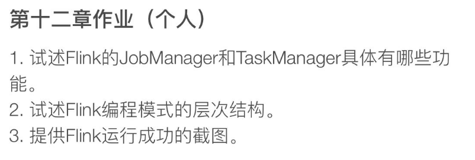
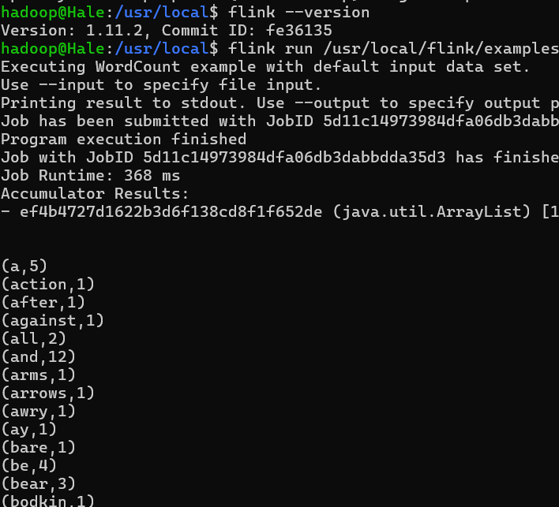

# homework 12

## Q1

### JobManager

**JobManager** 是 Flink 集群中的主控节点，负责管理资源、调度和应用程序的生命周期。其具体功能包括：

- **作业调度**：JobManager 接受用户提交的作业，并将其分解为 TaskManagers 可以执行的任务。
- **资源管理**：它协调可用资源，例如 CPU、内存和磁盘空间，以及作业优先级和队列管理。
- **任务分配**：它为 TaskManagers 分配任务执行，并监控它们的执行状态。
- **容错管理**：JobManager 负责作业的检查点和恢复，管理作业的容错性，包括重启失败的任务。
- **状态管理**：管理作业状态和检查点的存储，通常与分布式存储系统（如 HDFS 或 S3）合作。
- **通信**：作为集群中的中心节点，处理与 TaskManagers 和客户端的所有通信，包括任务状态更新和指令传输。

### TaskManager

**TaskManager** 是 Flink 集群中的工作节点，负责执行 JobManager 分配的任务。其主要功能包括：

- **任务执行**：每个 TaskManager 可以并行运行多个任务。它负责执行具体的数据处理操作，如数据转换、聚合或过滤等。
- **缓冲和状态管理**：管理本地数据缓冲和处理过程中的中间状态。
- **资源提供**：为任务提供必要的处理资源，如内存和 CPU。
- **数据交换**：负责与其他 TaskManager 节点之间的数据交换，实现不同任务间的数据传输和通信。
- **故障恢复**：在任务执行失败时，能够从最近的检查点恢复任务状态并重新执行，确保数据处理的精确一致性。
- **度量和监控**：收集运行指标和日志，帮助监控任务的执行状态和集群的健康状况。

## Q2

Apache Flink 是一个高性能、可扩展的流处理和批处理框架，其分布式执行机制是其核心特点之一。Flink的分布式执行涉及以下关键组件和步骤：

1. **作业提交**：用户将作业提交给Flink集群，通常通过Flink的客户端或API接口。

2. **作业管理器（JobManager）**：作业管理器首先接收并解析作业，然后进行优化（如合并可连续的操作），并将作业转化为一个执行图（Execution Graph），该图明确了任务之间的依赖关系及其并行度。

3. **任务调度**：JobManager 根据 Execution Graph 将任务（作业中的独立单位）分配给不同的 TaskManager（执行节点）。每个任务可能会被划分为一个或多个子任务或任务槽，以实现并行处理。

4. **任务执行**：TaskManager 接收任务，并在配置的任务槽中执行。每个 TaskManager 可能会并行运行多个任务，根据其可用的资源和配置的并行度。

5. **状态和容错处理**：Flink提供了强大的状态管理和容错机制。通过定期的检查点（Checkpointing），Flink能够记录应用状态，以便在出现故障时能够从最近的检查点恢复，从而保证数据处理的一致性和准确性。

6. **数据传输和缓冲**：任务之间的数据通过网络进行传输。Flink优化了数据的缓冲和传输，减少了延迟，并确保高效的数据流转。

7. **动态缩放和资源管理**：Flink支持动态缩放，可以根据负载增减 TaskManager 实例。

## Q3

