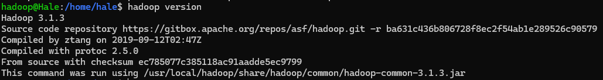

## Homework 2


### Q1

**Hadoop生态系统及各部分功能**

Hadoop是一个开源的分布式存储与计算平台，由Apache软件基金会维护。它主要设计用于处理大量数据集的存储与分析。Hadoop生态系统包括多个组件，每个组件都服务于不同的数据处理需求：

- **HDFS（Hadoop Distributed File System）**：这是Hadoop的分布式文件系统，负责数据的存储。它将数据块分散存储在整个集群的多个节点上，从而提供高吞吐量的数据访问，同时通过数据副本机制确保数据的可靠性和容错性。
- **MapReduce**：这是一个编程模型和软件框架，用于处理大规模数据集。用户可以编写MapReduce程序来进行大规模的数据分析和转换。MapReduce作业通常分为两个阶段：Map阶段和Reduce阶段。
- **YARN（Yet Another Resource Negotiator）**：这是Hadoop的资源管理层，负责集群资源的管理和作业调度。它允许多种数据处理引擎如MapReduce和Spark等同时在Hadoop上运行，有效管理资源。
- **Pig**：这是一个高级平台，用于创建MapReduce程序。使用Pig Latin语言，它允许用户描述数据流，自动转换成可执行的MapReduce任务。
- **Hive**：这是一个建立在Hadoop上的数据仓库框架，允许数据摘要、查询和分析。Hive使得用户可以通过类SQL语言（HQL）来查询数据，这些查询将被转换为MapReduce任务。
- **HBase**：这是一个非关系型分布式数据库（NoSQL），运行在HDFS之上。它适用于需要随机、实时读/写访问大数据集的应用。
- **Zookeeper**：这是一个为分布式应用提供协调服务的高性能服务。Zookeeper维护配置信息、命名、提供分布式同步等服务。

### Q2

1. 创建Hadoop 用户, 设置密码并且添加权限

```shell
sudo useradd -m hadoop -s /bin/bash
sudo passwd hadoop
sudo adduser hadoop sudo
```

2. 安装java环境，修改环境变量

```shell
cd /usr/lib
sudo mkdir jvm 
cd ~ 	
sudo tar -zxvf ./jdk-8u162-linux-x64.tar.gz -C /usr/lib/jvm  #
vim ~/.bashrc
```

​	添加如下的内容到`~/.bashrc`文件中:

```bash
export JAVA_HOME=/usr/lib/jvm/jdk1.8.0_162
export JRE_HOME=${JAVA_HOME}/jre
export CLASSPATH=.:${JAVA_HOME}/lib:${JRE_HOME}/lib
export PATH=${JAVA_HOME}/bin:$PATH
```

​	确认java安装是否成功

```shell
java -version
```

3. 安装Hadoop3.1.3 解压到文件夹内，并且进行单机配置（非分布式）

```shell
sudo tar -zxf ~/download/hadoop-3.1.3.tar.gz -C /usr/local
cd /usr/local/
sudo mv ./hadoop-3.1.3/ ./hadoop
sudo chown -R hadoop ./hadoop
```

​	检查是否安装成功

```shell
cd /usr/local/hadoop
./bin/hadoop version
```

4. 配置伪分布式的环境，伪分布式需要修改2个配置文件 **core-site.xml** 和 **hdfs-site.xml** 。Hadoop的配置文件是 xml 格式，每个配置以声明 property 的 name 和 value 的方式来实现。修改`./etc/hadoop/core-site.xml`为如下的内容:

```xml
<configuration>
    <property>
        <name>hadoop.tmp.dir</name>
        <value>file:/usr/local/hadoop/tmp</value>
        <description>Abase for other temporary directories.</description>
    </property>
    <property>
        <name>fs.defaultFS</name>
        <value>hdfs://localhost:9000</value>
    </property>
</configuration>
```

​	同时修改配置文件`hdfs-site.xml` 为如下内容

```xml
<configuration>
    <property>
        <name>dfs.replication</name>
        <value>1</value>
    </property>
    <property>
        <name>dfs.namenode.name.dir</name>
        <value>file:/usr/local/hadoop/tmp/dfs/name</value>
    </property>
    <property>
       <name>dfs.datanode.data.dir</name>
       <value>file:/usr/local/hadoop/tmp/dfs/data</value>
    </property>
</configuration>
```

​	配置完成后，执行NameNode的格式化

```shell
cd /usr/local/hadoop
./bin/hdfs namenode -format
```

​	此时启动Hadoop即可

```shell
cd /usr/local/hadoop
./sbin/start-dfs.sh
```


### Q3

**安装成功截图**


