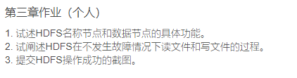
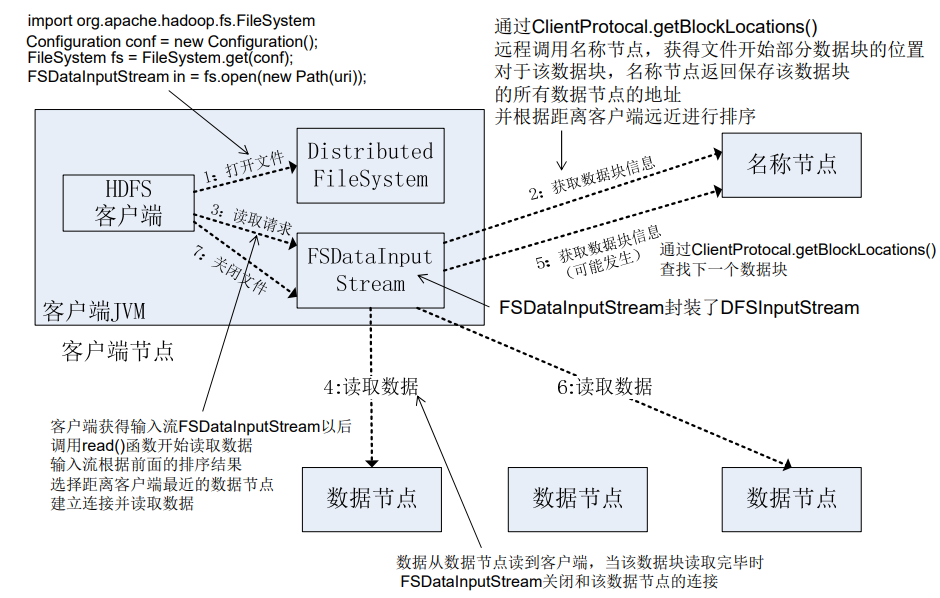
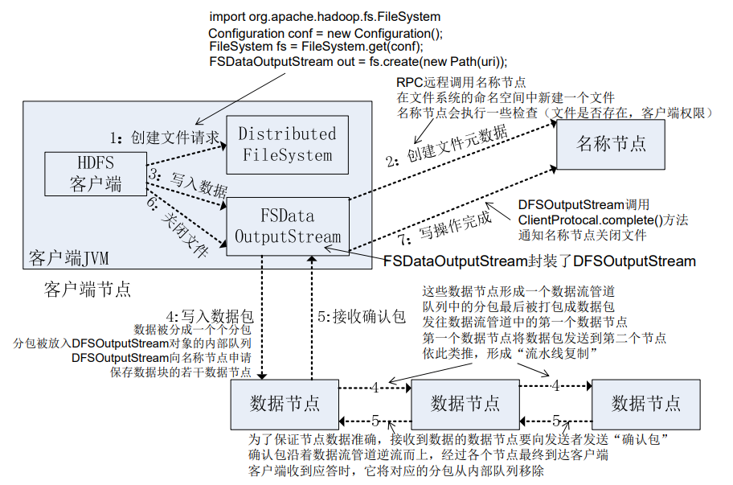
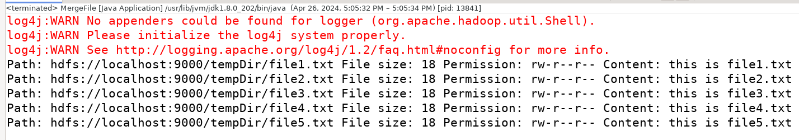
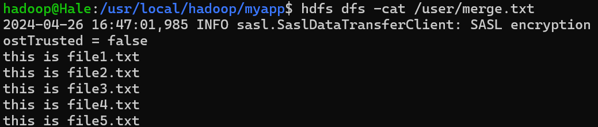

## Homework 3



### Q1

**HDFS 名称节点和数据节点的具体功能**

名称节点(Name Node)，负责管理分布式文件系统的命名空间(Namespace), 保存了两个核心的数据结构，即`FsImage`和`EditLog`

- `FsImage`用于维护文件系统树以及文件数中所有的文件和文件夹的元数据
  - FsImage文件包含文件系统中所有目录和文件inode的序列化形式。每个inode是一个文件或目录的元数据的内部表示，并包含此类信息：文件的复制等级、修改和访问时间、访问权限、块大小以及组成文件的块。对于目录，则存储修改时间、权限和配额元数据； 
  - FsImage文件没有记录文件每个块存储在哪个数据节点，而是由名称节点把这些映射信息保留在内存中。当数据节点加入HDFS集群时，数据节点会把自己所包含的块列表告知给名称节点，此后会定期执行这种告知操作，以确保名称节点的块映射是最新的 
- 操作日志`EditLog`中记录了所有针对文件的创建、删除、重命名等操作

其具体功能表现在：

1. 存储元数据(Meta Data)
2. 元数据保存在内存(memory)中
3. 保存 `block` 和 `datanode` 之间的映射关系

数据节点(Data Node), 是分布式文件系统HDFS的工作节点，负责数据的存储和读取，会根据客户端或者是名称节点的调度来进行数据的存储和检索，并且向名称节点定期发送自己所存储的块的列表；每个数据节点中的数据会被保存在各自节点的本地Linux 文件系统中 

其具体功能表现在：

1. 存储文件内容
2. 文件内容保存在磁盘
3. 维护了`block id`到`datanode`本地文件的映射关系 

### Q2

读出数据的过程：



写入数据的过程


### Q3

**HDFS常用指令**：

```shell
hadoop fs -ls <path>
hadoop fs -mkdir <path>
hadoop fs -cat <path>
hadoop fs -copyFromLocal <localsrc> <dst>
```

按照课件要求安装完成`Eclipse`并且正确创建项目之后，`Run as Java application`得到如下的结果


查看具体的`merge.txt` 文件有


下面是自己调整过后的代码，因为Eclipse本身不直接支持`GBK` 编码，所有注释全部重写并且调整了文件路径

```java
import java.io.IOException;
import java.io.PrintStream;
import java.net.URI;
import org.apache.hadoop.conf.Configuration;
import org.apache.hadoop.fs.*;

/*
 * filter files with specific filename 
 */
class MyPathFilter implements PathFilter {
	String reg = null;

	MyPathFilter(String reg) {
		this.reg = reg;
	}

	public boolean accept(Path path) {
		if (!(path.toString().matches(reg)))
			return true;
		return false;
	}
}

/***
 * Using FSDataOutputStream and FSDataInputStream to merge files in HDFS
 */
public class MergeFile {
	Path inputPath = null;
	Path outputPath = null;

	public MergeFile(String input, String output) {
		this.inputPath = new Path(input);
		this.outputPath = new Path(output);
	}

	public void doMerge() throws IOException {
		// configure current hdfs file location
		Configuration conf = new Configuration();
		conf.set("fs.defaultFS", "hdfs://localhost:9000");
		conf.set("fs.hdfs.impl", "org.apache.hadoop.hdfs.DistributedFileSystem");
		FileSystem fsSource = FileSystem.get(URI.create(inputPath.toString()), conf);
		FileSystem fsDst = FileSystem.get(URI.create(outputPath.toString()), conf);
		
		// filter the files whose suffix is abc
		FileStatus[] sourceStatus = fsSource.listStatus(inputPath, new MyPathFilter(".*\\.abc"));
		FSDataOutputStream fsdos = fsDst.create(outputPath);
		PrintStream ps = new PrintStream(System.out);
		
		// read content from filtered files and add them into a single file 
		for (FileStatus sta : sourceStatus) {
			// print out some hint message
			System.out.print("Path: " + sta.getPath() + " File size: " + sta.getLen() + " Permission: " + sta.getPermission() + " Content: ");
			FSDataInputStream fsdis = fsSource.open(sta.getPath());
			byte[] data = new byte[1024];
			int read = -1;
			while ((read = fsdis.read(data)) > 0) {
				ps.write(data, 0, read);
				fsdos.write(data, 0, read);
			}
			fsdis.close();
		}
		ps.close();
		fsdos.close();
	}
	
	// execute merge operation on hdfs
	public static void main(String[] args) throws IOException {
		MergeFile merge = new MergeFile("hdfs://localhost:9000/tempDir/",
				"hdfs://localhost:9000/user/merge.txt");
		merge.doMerge();
	}
}

```


