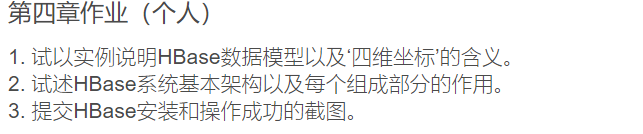
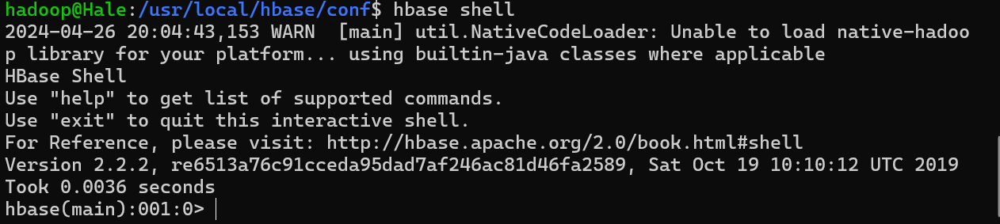
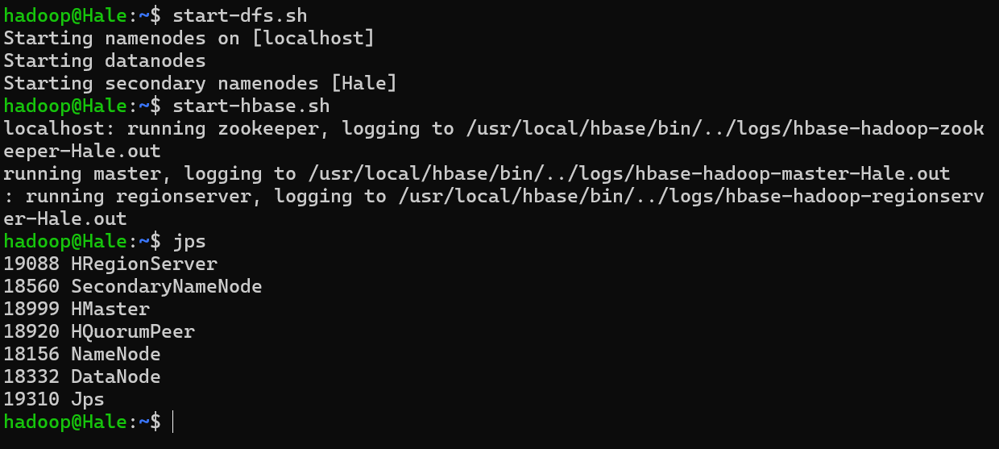
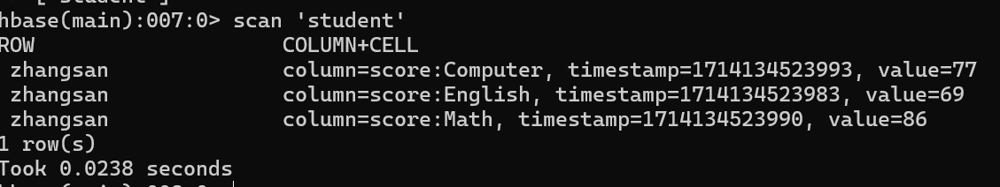

## Homework 4



### Q1

### HBase数据模型的组件

1. **行键（Row Key）**: 每行数据都有一个唯一的行键，它是检索数据的主要方式。
2. **列族（Column Family）**: 列族是一组列的集合，物理存储在一起。每个表至少有一个列族。
3. **列限定符（Column Qualifier）**: 列族中的一个特定的列。
4. **时间戳（Timestamp）**: 数据的版本。每当数据更新时，都会根据时间戳来保留不同的版本。

### 四维坐标的含义

所谓的“四维坐标”，指的是HBase中用来唯一标识和访问数据的四个维度：

1. **行键**
2. **列族**
3. **列限定符**
4. **时间戳**

### 实例说明

假设我们有一个用来存储社交媒体用户信息的HBase表“Users”，具有两个列族：`info` 和 `contact`。

- **行键**: 用户ID，如 "user1234"
- **列族**: "info" (存储用户信息)，"contact" (存储联系方式)
- **列限定符**: 在"info"列族中可能有"username"和"age"，在"contact"列族中可能有"email"和"phone"
- **时间戳**: 表示数据版本的时间戳，如果用户的信息更改过多次，每个版本都将有不同的时间戳。

```txt
Users 表:

Row Key    | Column Family: info     | Column Family: contact
            ----------------------------------------------------
            | username | age         | email         | phone
----------------------------------------------------
user1234    | john_doe | 28          | john@example.com | 555-0100
            ----------------------------------------------------
            |          |             | (2019-01-01)     | (2019-01-01)
            |          |             | john@newdomain.com | 555-0102
            |          |             | (2020-06-01)     | (2020-06-01)

```

在这个表中，“四维坐标”可以是 ("user1234", "info", "username", 1590995460000)。这将返回行键为"user1234"，列族为"info"，列限定符为"username"的值，对应时间戳是1590995460000的数据版本。

### Q2

HBase是建立在Hadoop文件系统（HDFS）之上的分布式列存储系统，设计用来扩展到成千上万的节点，来管理大量的结构化数据。它是为了提供一个高性能的、动态的、支持大数据集的存储方案。下面是HBase系统的基本架构及其组成部分的作用：

### HBase架构的主要组件：

1. **HMaster**：
   - **管理角色**：HMaster主要负责表和区域的管理操作，比如表的创建、删除、区域的分配和负载均衡。
   - **监控角色**：HMaster监控RegionServer的状态，处理服务器故障时的故障恢复。
2. **RegionServer**：
   - **数据存储角色**：RegionServer负责处理来自客户端的读写请求，并确保读写操作正确地存储在HDFS中。
   - **区域管理角色**：每个RegionServer管理一系列的Region，Region是表的水平分割，是数据的物理存储单位。
3. **Region**：
   - **数据分片**：Region是表的子集，它包含了行键从一个起点到一个终点的数据。当Region太大时，它会被分裂成两个新的Region。
   - **数据访问单位**：Region是客户端访问数据的最小单元。
4. **ZooKeeper**：
   - **协调服务**：ZooKeeper是一个分布式协调服务，它为HBase集群提供必要的服务，如配置维护、区域服务器的心跳检测、元数据的存储等。
   - **故障检测**：ZooKeeper可以监测RegionServer的状态，帮助HMaster进行故障恢复。
5. **HDFS（Hadoop Distributed File System）**：
   - **数据持久化**：HDFS是HBase数据存储的底层支撑，提供了高可靠性和高吞吐量的数据存储服务。
   - **分布式存储**：通过在多个节点之间分布数据，HDFS保证了数据的冗余和容错。
6. **HBase Client**：
   - **接口角色**：客户端API提供接口给应用程序，用于执行对HBase表的操作，如数据的读取、插入、更新和删除。
7. **HBase Catalog Tables**：
   - **元数据存储**：HBase有两个重要的目录表：`-ROOT-`和`.META.`。ROOT表存储了指向META表的信息，而META表则存储了指向所有Region的信息。
   - **定位数据**：这些表帮助客户端找到存储特定数据的Region位置。

每个组件在HBase架构中都扮演了不同但协同工作的角色，共同提供一个高可用性、可扩展的大数据存储解决方案。HBase利用HDFS的强大存储能力，结合了高效的读写操作，并通过HMaster和RegionServer的管理机制，确保了数据的快速访问和系统的稳定运行。通过ZooKeeper的协调，HBase能够处理节点故障，确保元数据和系统状态的一致性。

### Q3







