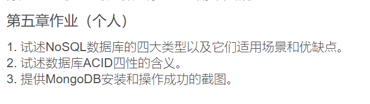
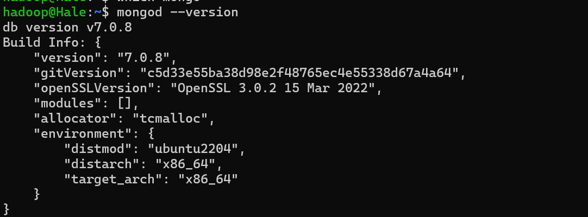
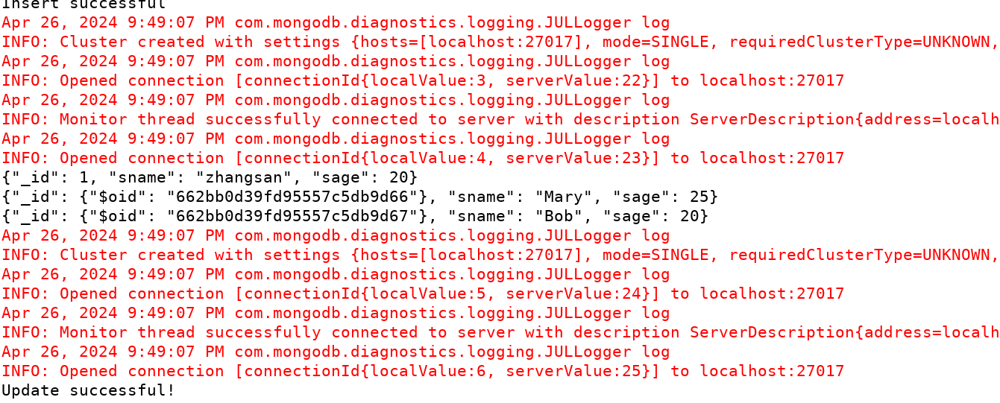
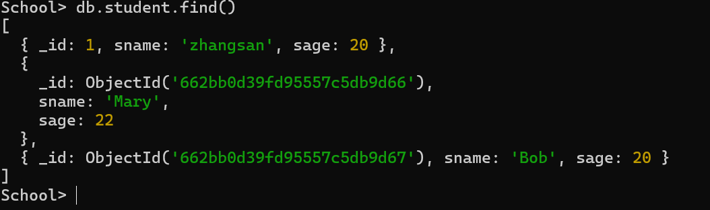

## Homework5

### Q1

NoSQL数据库主要分为四种类型：键值数据库、列族数据库、文档数据库和图形数据库:

1. **键值数据库**：
   - **优点**：具有良好的扩展性和灵活性，性能在大量写操作时较高。
   - **缺点**：无法存储结构化信息，条件查询效率较低。
   - **适用场景**：适用于涉及频繁读写操作的简单数据模型应用，如内容缓存、会话、配置文件、购物车等。
   - **示例产品**：Redis, Riak, SimpleDB。
2. **列族数据库**：
   - **优点**：查找速度快，可扩展性强，容易进行分布式扩展，复杂性低。
   - **缺点**：功能较少，大多数不支持强事务一致性。
   - **适用场景**：适用于分布式数据存储管理，尤其是数据分布在地理上多个数据中心的应用程序。
   - **示例产品**：BigTable, HBase, Cassandra。
3. **文档数据库**：
   - **优点**：性能好（适合高并发），灵活性高，数据结构灵活，支持嵌入式文档功能。
   - **缺点**：缺乏统一的查询语法。
   - **适用场景**：存储、索引并管理面向文档的数据或类似的半结构化数据，适用于使用JSON数据结构的应用。
   - **示例产品**：MongoDB, CouchDB, Terrastore。
4. **图形数据库**：
   - **优点**：灵活性高，支持复杂的图形算法，可用于构建复杂的关系图谱。
   - **缺点**：复杂性高，只能支持一定的数据规模。
   - **适用场景**：处理具有高度相互关联关系的数据，适合于社交网络、模式识别、依赖分析、推荐系统及路径寻找等问题。
   - **示例产品**：Neo4J, OrientDB, Infinite Graph。

### Q2

事务性数据库有ACID四性

- **A (Atomicity)**：原子性，是指事务必须是原子工作单元，对于其数据修改，要么全都执行，要么全都不执行； 
- **C (Consistency):** 一致性，是指事务在完成时，必须使所有的数据都保持一致状态； 
- **I (Isolation):** 隔离性，是指由并发事务所做的修改必须与任何其它并发事务所做的修改隔离； 
- **D (Durability)**: 持久性，是指事务完成之后，它对于系统的影响是永久性的，该修改即使出现致命的系统故障也将一直保持。 

### Q3

验证`mongodb`的版本和使用

创建一个Eclipse工程并且导入需要的`jar`包并且运行得到如下的结果:

查看本机`mongodb`中的数据，使用`mongoshell`有如下：

