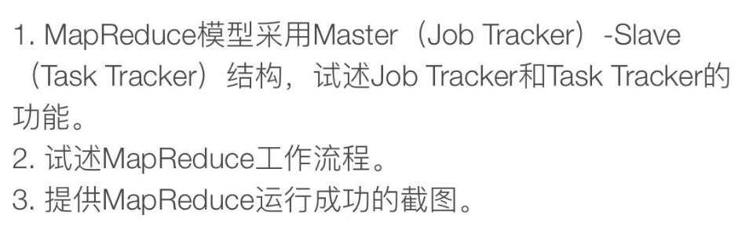
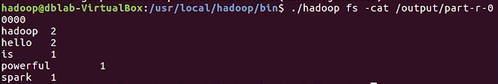

# Homework7

## Q1

MapReduce模型采用Master-Slave架构，其中Master节点称为JobTracker，Slave节点称为TaskTracker。

### JobTracker（主节点）

1. **作业管理**：
   - **作业调度**：负责接收来自客户端的作业（job）请求，拆分为多个任务（task）并分配给各个TaskTracker执行。
   - **资源分配**：根据集群中各个TaskTracker的资源情况，合理分配任务，确保资源的有效利用。

2. **任务监控**：
   - **任务追踪**：实时监控每个TaskTracker上任务的执行情况，记录任务的状态和进度。
   - **失败处理**：当检测到某个任务失败时，重新调度该任务到其他TaskTracker上执行，确保作业能够成功完成。

3. **负载均衡**：
   - **数据本地性优化**：尽量将任务分配到数据所在的节点上，以减少数据传输，提高执行效率。

4. **系统管理**：
   - **健康检查**：定期检查TaskTracker的健康状态，确保集群的稳定运行。
   - **日志记录**：记录作业执行的详细日志，便于故障排查和系统调优。

### TaskTracker（从节点）

1. **任务执行**：
   - **任务接收**：从JobTracker接收任务，并在本地执行这些任务（包括Map任务和Reduce任务）。
   - **任务报告**：定期向JobTracker报告任务的执行状态和进度。

2. **资源管理**：
   - **资源监控**：监控本地资源的使用情况，如CPU、内存、磁盘等，确保任务能够顺利执行。
   - **任务分配**：根据本地资源情况，合理分配任务执行的资源。

3. **任务管理**：
   - **任务重启**：在任务执行失败时，尝试重新执行任务，确保任务能够完成。
   - **中间数据存储**：在本地存储Map任务的输出结果（中间数据），供Reduce任务使用。

4. **故障处理**：
   - **任务失败报告**：当任务执行失败时，及时向JobTracker报告，便于JobTracker进行重新调度。
   - **节点故障报告**：当节点发生故障时，及时通知JobTracker，以便系统进行故障恢复。

## Q2

### 1. 作业提交（Job Submission）

客户端提交一个MapReduce作业（job）给JobTracker。这个作业包括输入数据的位置、Map和Reduce函数的定义、输出数据的位置和配置参数。

### 2. 作业初始化（Job Initialization）

JobTracker接收到作业请求后，将作业划分成多个任务（tasks），包括Map任务和Reduce任务。JobTracker还会为每个任务分配一个唯一的任务ID，并创建作业的运行环境。

### 3. Map任务执行（Map Task Execution）

1. **任务分配**：
   - JobTracker将Map任务分配给各个TaskTracker。优先将任务分配给存储输入数据的节点，以减少数据传输。

2. **数据读取**：
   - TaskTracker读取本地文件系统或HDFS中的输入数据。

3. **执行Map函数**：
   - TaskTracker对读取到的数据块执行用户定义的Map函数，将输入数据转换为键值对（key-value pairs）。

4. **中间数据存储**：
   - Map任务生成的中间数据会被临时存储在本地磁盘上，并进行分区，每个分区对应一个Reduce任务。

### 4. Shuffle和Sort（Shuffle and Sort）

1. **Shuffle**：
   - Map任务完成后，TaskTracker将中间数据根据键值对的键进行分区和排序，并将这些数据发送给相应的Reduce任务所在的TaskTracker。

2. **Sort**：
   - 每个Reduce任务在接收到来自不同Map任务的中间数据后，会对这些数据进行合并和排序。

### 5. Reduce任务执行（Reduce Task Execution）

1. **任务分配**：
   - JobTracker将Reduce任务分配给TaskTracker。

2. **执行Reduce函数**：
   - TaskTracker对合并排序后的中间数据执行用户定义的Reduce函数，将中间结果汇总成最终结果。

3. **输出数据存储**：
   - Reduce任务的输出数据会被写入到HDFS或本地文件系统中。

### 6. 作业完成（Job Completion）

1. **状态报告**：
   - TaskTracker定期向JobTracker报告任务的执行状态。

2. **作业完成通知**：
   - 当所有的Map和Reduce任务都成功完成后，JobTracker会通知客户端作业完成。

3. **清理工作**：
   - JobTracker和TaskTracker清理作业运行过程中产生的临时数据和资源。

MapReduce通过将大规模数据处理任务分解为小任务，并行执行Map和Reduce函数，实现了高效的数据处理和分析。JobTracker负责任务的调度和监控，而TaskTracker负责具体任务的执行和状态报告，确保作业的顺利完成。

## Q3

运行成功截图如下所示：

