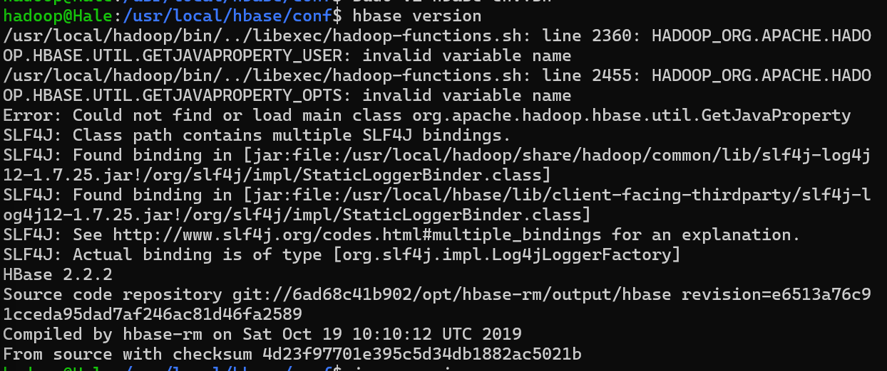
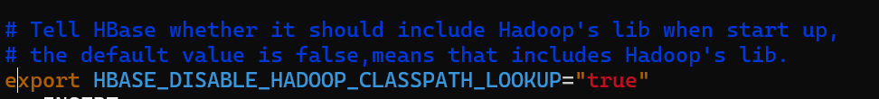
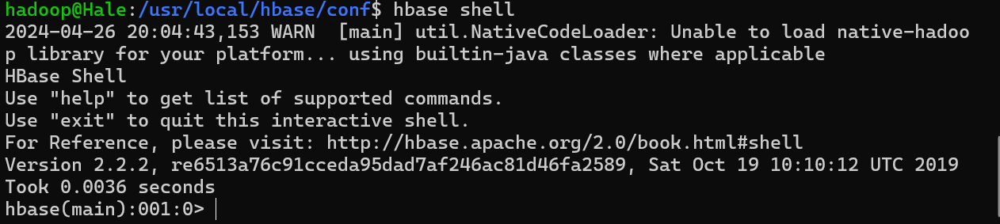
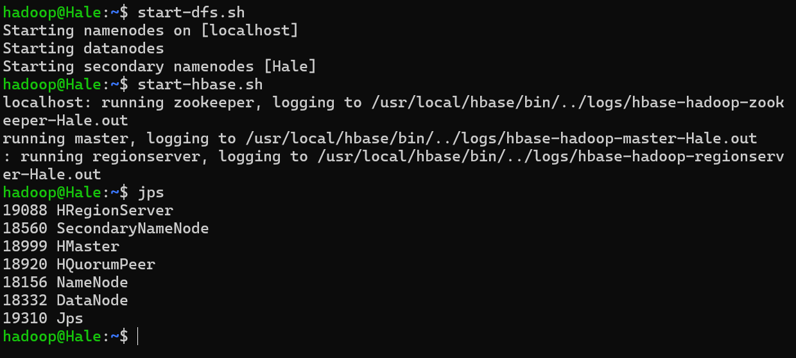
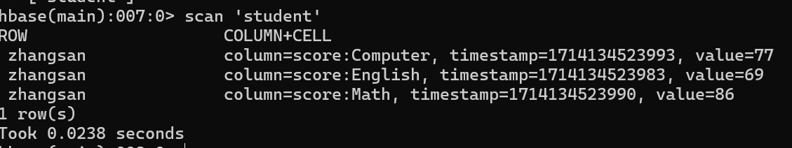

## Chapter 5 HBase

按照教程安装`Hbase2.2.2`版本，过去版本的链接：[link](https://archive.apache.org/dist/hbase/2.2.2/)

安装完成，测试版本：



上面出现很多报错信息，根据[CSDN博客](https://blog.csdn.net/weixin_45048331/article/details/109823555)知道只需要将`/usr/local/hbase/conf/hbase-env.sh`中的最后一行注释掉即可即



这样就可以完成验证并且后续启动了

```shell
$ cd /usr/local/hbase
$ start-hbase.sh
$ hbase shell
```



### 伪分布式模式配置

添加如下这些信息到`./conf/hbase-site.xml`文件中

```xml
<configuration>
        <property>
                <name>hbase.rootdir</name>
                <value>hdfs://localhost:9000/hbase</value>
        </property>
        <property>
                <name>hbase.cluster.distributed</name>
                <value>true</value>
        </property>
        <property>
                <name>hbase.unsafe.stream.capability.enforce</name>
                <value>false</value>
        </property>
</configuration>
```

配置完成并且启动：



### HBase Shell 基本指令

创建表并且插入数据

```shell
hbase> create 'student', 'Sname', 'Ssex', 'Sage', 'Sdept', 'course'
hbase> put 'student', '95001', 'Sname', 'LiYing'
hbase> put 'student','95001','Ssex','male'
hbase> put 'student','95001','Sage','22'
hbase> put 'student','95001','Sdept','CS'
hbase> put 'student','95001','course:math','80'
```

查看当前插入的数据`get 'student' '95001'`

```shell
hbase(main):013:0> get 'student', '95001'
COLUMN                 CELL
 Sage:                 timestamp=1714133575020, value=22
 Sdept:                timestamp=1714133579746, value=CS
 Sname:                timestamp=1714133544278, value=LiYing
 Ssex:                 timestamp=1714133568757, value=male
 course:math           timestamp=1714133588830, value=80
1 row(s)
Took 0.0394 seconds
```

删除数据 & 删除表

```shell
# delete part of data
hbase> delete 'student', '95001', 'Ssex'  	# delete all data for the column of `Ssex` of `95001`
hbase> deleteall 'student', '65001' 	    # delete all data for '95001'

# delete table 
hbase> disable 'student'			       # first, disable the table
hbase> drop 'student' 					  # second, drop the table
```

### 编程实战

创建项目，粘贴如下代码：

```java
import org.apache.hadoop.conf.Configuration;
import org.apache.hadoop.hbase.*;
import org.apache.hadoop.hbase.client.*;
import org.apache.hadoop.hbase.util.Bytes;


import java.io.IOException;
public class ExampleForHBase {
    public static Configuration configuration;
    public static Connection connection;
    public static Admin admin;
    public static void main(String[] args)throws IOException{
        init();
    	createTable("student",new String[]{"score"});
        insertData("student","zhangsan","score","English","69");
        insertData("student","zhangsan","score","Math","86");
        insertData("student","zhangsan","score","Computer","77");
        getData("student", "zhangsan", "score","English");
        close();
    }
    public static void init(){
        configuration  = HBaseConfiguration.create();
        configuration.set("hbase.rootdir","hdfs://localhost:9000/hbase");
        try{
            connection = ConnectionFactory.createConnection(configuration);
            admin = connection.getAdmin();
        }catch (IOException e){
            e.printStackTrace();
        }
    }
    public static void close(){
        try{
            if(admin != null){
                admin.close();
            }
            if(null != connection){
                connection.close();
            }
        }catch (IOException e){
            e.printStackTrace();
        }
    }
    public static void createTable(String myTableName,String[] colFamily) throws IOException {
        TableName tableName = TableName.valueOf(myTableName);
        if(admin.tableExists(tableName)){
            System.out.println("talbe is exists!");
        }else {
            TableDescriptorBuilder tableDescriptor = TableDescriptorBuilder.newBuilder(tableName);
            for(String str:colFamily){
                ColumnFamilyDescriptor family = 
ColumnFamilyDescriptorBuilder.newBuilder(Bytes.toBytes(str)).build();
                tableDescriptor.setColumnFamily(family);
            }
            admin.createTable(tableDescriptor.build());
        } 
    }
    public static void insertData(String tableName,String rowKey,String colFamily,String col,String val) throws IOException { 
        Table table = connection.getTable(TableName.valueOf(tableName));
        Put put = new Put(rowKey.getBytes());
        put.addColumn(colFamily.getBytes(),col.getBytes(), val.getBytes());
        table.put(put);
        table.close(); 
    }

    public static void getData(String tableName,String rowKey,String colFamily, String col)throws  IOException{ 
        Table table = connection.getTable(TableName.valueOf(tableName));
        Get get = new Get(rowKey.getBytes());
        get.addColumn(colFamily.getBytes(),col.getBytes());
        Result result = table.get(get);
        System.out.println(new String(result.getValue(colFamily.getBytes(),col==null?null:col.getBytes())));
        table.close(); 
    }
}
```

运行并且在`hbase shell`中查看结果



