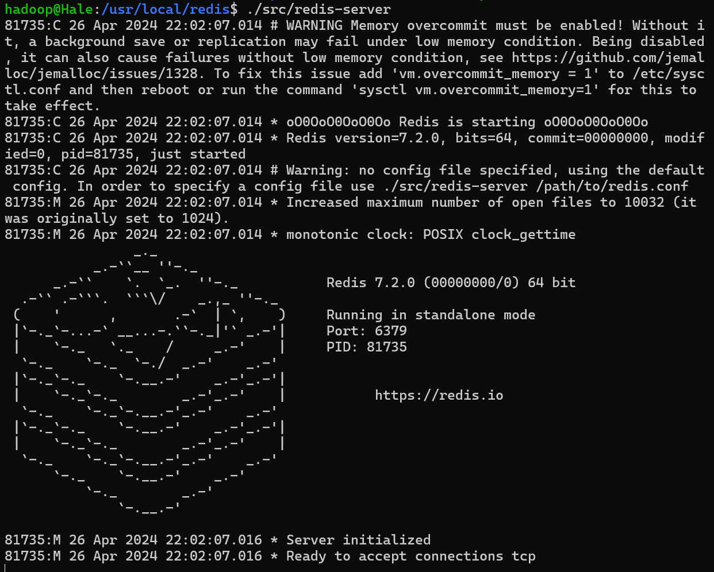
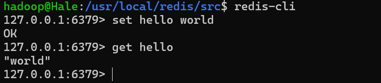
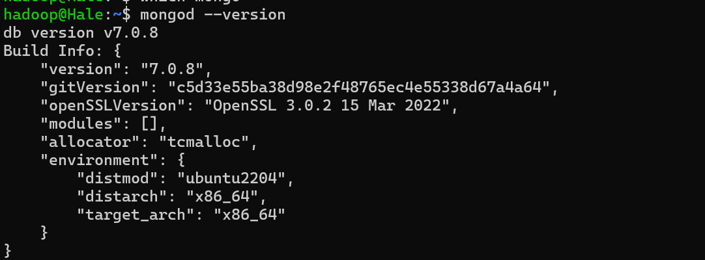
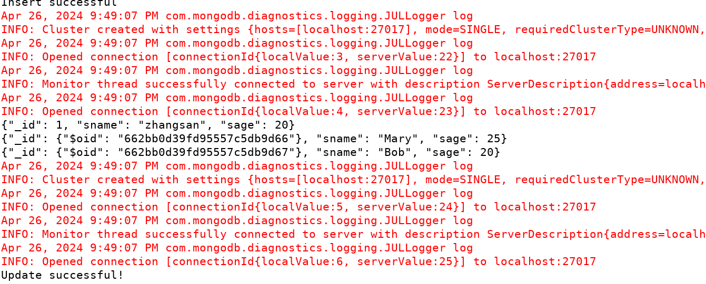
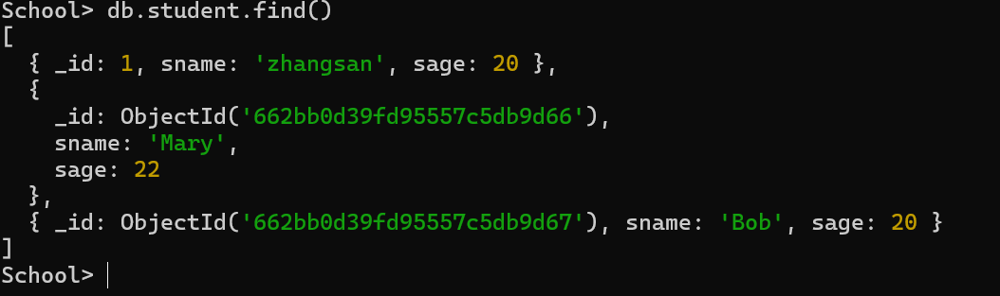

## Chapter 6 NoSQL 

### Redis

Redis的安装，建议安装最新版本，不要使用`redis5.0.5`版本，会无法安装上

```shell
$ cd ~
$ sudo tar -zxvf ./下载/redis-7.X.X.tar.gz -C /usr/local
$ cd /usr/local
$ sudo mv ./redis-7.X.X ./redis
$ sudo chown -R hadoop:hadoop ./redis
$ sudo make
$ sudo make install
```





key和value的确定方法如下：

- key=表名:主键值:列名
- value=列值

插入/修改:`set key value` 删除: `del key`  获取数据 `get key`

### MongoDB

根据[官方给的最新文档](https://www.mongodb.com/zh-cn/docs/manual/tutorial/install-mongodb-on-ubuntu/)可以将mongoDB安装到ubuntu上面：

```shell
$ sudo apt-get install gnupg curl
$ curl -fsSL https://www.mongodb.org/static/pgp/server-7.0.asc | \
   sudo gpg -o /usr/share/keyrings/mongodb-server-7.0.gpg \
   --dearmor
$ echo "deb [ arch=amd64,arm64 signed-by=/usr/share/keyrings/mongodb-server-7.0.gpg ] https://repo.mongodb.org/apt/ubuntu jammy/mongodb-org/7.0 multiverse" | sudo tee /etc/apt/sources.list.d/mongodb-org-7.0.list
$ sudo apt-get update
$ sudo apt-get install -y mongodb-org
```

验证`mongodb`的版本和使用



#### 插入数据

```shell
> db.[collections].insertOne({XXXX})
> db.[collections].save({XXXX})
> db.[collections].([
	{
		XXXXX
	},
	{
		XXXX
	}
])  
```

#### 查找数据

```shell
> db.[collections].find()
> db.[collections].find({some restrctions})
> db.find(XXX).pretty()
```

#### 使用Java API

```java
package mongoDB;

import java.util.ArrayList;
import java.util.List;
import org.bson.Document;
import com.mongodb.MongoClient;
import com.mongodb.client.MongoCollection;
import com.mongodb.client.MongoCursor;
import com.mongodb.client.MongoDatabase;
import com.mongodb.client.model.Filters;

public class mongodbExample {
	/**
	 * Main method
	 * 
	 * @param args
	 */
	public static void main(String[] args) {
		insert(); // Insert data. To execute insertion, comment out the other three function
					// calls, and vice versa.
		find(); // Find data
		update(); // Update data
	}

	/**
	 * Returns a specified collection from a specified database
	 * 
	 * @param dbname         Database name
	 * @param collectionname Collection name
	 * @return MongoCollection<Document>
	 */
	// MongoDB does not require predefined databases and collections, they are
	// created automatically when used
	public static MongoCollection<Document> getCollection(String dbname, String collectionname) {
		// Instantiate a MongoClient, server address: localhost, port number: 27017
		MongoClient mongoClient = new MongoClient("localhost", 27017);
		// Instantiate a MongoDatabase
		MongoDatabase mongoDatabase = mongoClient.getDatabase(dbname);
		// Retrieve a collection from the database
		MongoCollection<Document> collection = mongoDatabase.getCollection(collectionname);
		return collection;
	}

	/**
	 * Insert data
	 */
	public static void insert() {
		try {
			// Connect to MongoDB, specify database name, and specify table name.
			MongoCollection<Document> collection = getCollection("School", "student"); // Database name: School,
																						// Collection name: student
			// Instantiate a document, document content: {sname: 'Mary', sage: 25}, can
			// append more fields if needed
			Document doc1 = new Document("sname", "Mary").append("sage", 25);
			// Instantiate a document, document content: {sname: 'Bob', sage: 20}
			Document doc2 = new Document("sname", "Bob").append("sage", 20);
			List<Document> documents = new ArrayList<Document>();
			// Add doc1 and doc2 to the documents list
			documents.add(doc1);
			documents.add(doc2);
			// Insert documents into the collection
			collection.insertMany(documents);
			System.out.println("Insert successful");
		} catch (Exception e) {
			System.err.println(e.getClass().getName() + ": " + e.getMessage());
		}
	}

	/**
	 * Find data
	 */
	public static void find() {
		try {
			MongoCollection<Document> collection = getCollection("School", "student"); // Database name: School,
																						// Collection name: student
			// Iterate through the documents collection retrieved via cursor
//          MongoCursor<Document> cursor = collection.find(new Document("sname", "Mary")).projection(new Document("sname", 1).append("sage", 1).append("_id", 0)).iterator(); // Find condition: sname='Mary'. Projection: show sname and sage, hide _id (_id is shown by default)
			// Find all data
			MongoCursor<Document> cursor = collection.find().iterator();
			while (cursor.hasNext()) {
				System.out.println(cursor.next().toJson());
			}
		} catch (Exception e) {
			System.err.println(e.getClass().getName() + ": " + e.getMessage());
		}
	}

	/**
	 * Update data
	 */
	public static void update() {
		try {
			MongoCollection<Document> collection = getCollection("School", "student"); // Database name: School,
																						// Collection name: student
			// Update documents, change documents with sname='Mary' to sage=22
			collection.updateMany(Filters.eq("sname", "Mary"), new Document("$set", new Document("sage", 22)));
			System.out.println("Update successful!");
		} catch (Exception e) {
			System.err.println(e.getClass().getName() + ": " + e.getMessage());
		}
	}
}
```

创建一个Eclipse工程并且导入需要的`jar`包并且运行得到如下的结果:



查看本机`mongodb`中的数据，使用`mongoshell`有如下：




