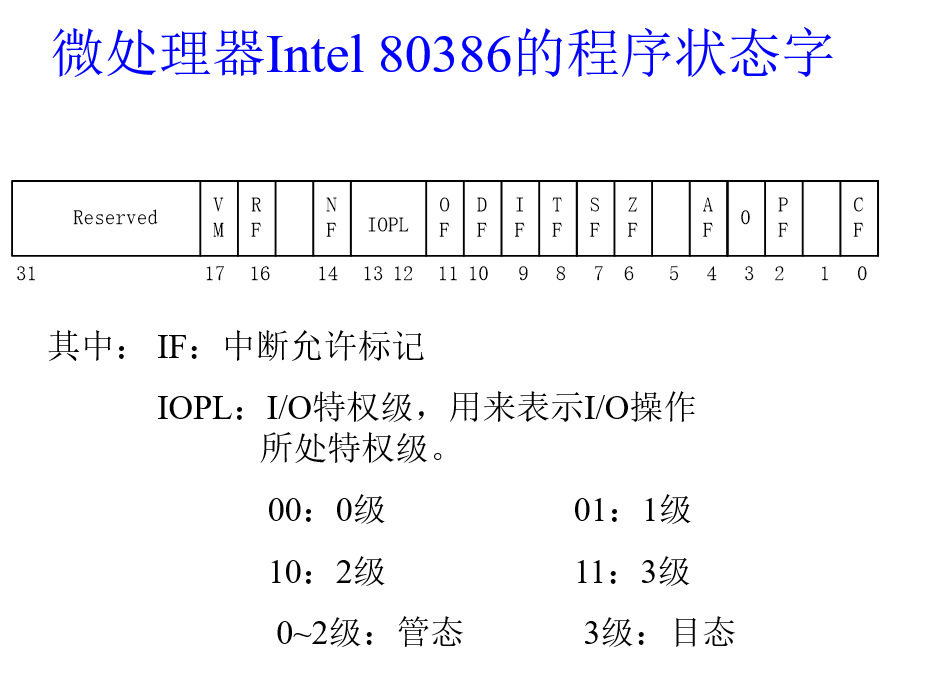

# Chapter 2 处理器管理

## 处理器状态

计算机系统的处理器包括一组寄存器，其个数根据机型的不同而不同，它们构成了一级存储，比主存容量小 ，但访问速度快。 这组寄存器所存储的信息与程序的执行有很大关系，构成了处理器现场。

寄存器分类：

- 通用寄存器-- EAX，EBX，ECX和EDX
- 指针及变址寄存器--ESP，EBP，ESI及EDI
- 段选择符寄存器--CS、DS、SS、ES 、FS、GS 
- 指令指针寄存器和标志寄存器--EIP、EFLAGS
- 控制寄存器--CR0，CR1，CR2和CR3 
- 外部设备使用的寄存器

每台计算机机器指令的集合称指令系统，它反映了一台机器的功能和处理能力，可以分为以下五类：

- 数据处理类指令：用于执行算术和逻辑运算。 
- I/O类指令：用于启动外围设备，让主存和设备交换数据。 
- 寄存器数据交换类指令：用于在处理器的寄存器和存储器之间交换数据。 
- 转移类指令：用于改变执行指令序列。
- 处理器控制指令：修改处理器状态，改变处理器工作方式。

从资源管理和控制程序执行的角度出发，把指令系统中的指令分作两部分：**特权指令**和**非特权指令。**

- **特权指令**是指只能提供给操作系统的核心程序使用的指令，如启动I/O设备、设置时钟、控制中断屏蔽位、清主存、建立存储键，加载PSW等。

处理器状态标志：**管理状态**（核心状态、特态或管态）和**用户状态**（目标状态、常态或目态)。

处理器处于管理状态时，程序可以执行全部指令，使用所有资源；处于用户状态时只能执行非特权指令。

## 中断技术

系统处理以下情况时，需要打断处理器正常工作：

- 请求系统服务
- 实现并行工作  
- 处理突发事件
- 满足实时要求

为此，提出了中断概念

**中断**是指程序执行过程中，遇到急需处理的事件时，暂时中止CPU上现行程序的运行，转去执行相应的事件处理程序，待处理完成后再返回原程序被中断处或调度其他程序执行的过程。

中断系统是实现中断功能的部件，包括中断装置和中断处理程序。

中断装置：指发现中断，响应中断的硬件。

1. 发现中断源，提出中断请求。
2.  保护现场 
3. 启动处理中断事件的程序 。 

中断处理程序：由软件来完成。主要任务是处理中断事件和恢复正常操作

 8086在内存的前1KB（地址00000H～003FFH）建立了一个中断向量表，可以容纳256个中断向量，每个中断向量占用4个字节。在这4个字节中，包含着这个中断向量的服务程序的入口地址——前两个字节为服务程序的IP，后两个字节为服务程序的CS。 

### 中断和异常的区别

1. 中断：由与现行指令无关的中断信号触发的(异步的)，且中断的发生与CPU处在用户模式或内核模式无关，在两条机器指令之间才可响应中断，一般来说，中断处理程序提供的服务不是为当前进程所需的； n异常：由处理器正在执行现行指令而引起的，一条指令执行期间允许响应异常，异常处理程序提供的服务是为当前进程所用的。异常包括很多方面（有出错(fault)，也有陷入(trap)等）。
2. 要求“中断”被快速处理，以便及时响应其它中断信号，所以，中断处理程序处理过程中是不能阻塞的。“异常”处于被打断的当前进程上下文中，所提供的服务是当前进程所需要的，所以，异常处理程序处理过程中是可以阻塞的。 
3. 中断允许发生嵌套，但异常大多为一重；异常处理过程中可能会产生中断，但中断处理过程中决不会被异常打断。 

每个能发送中断信号的硬件设备控制器都有一根输出线，它与中断控制器8259A的输入引脚相连，若一个硬件设备欲向CPU发送中断信号，必须申请一条可用的“中断请求线”，或者说必须申请一个IRQ号，这就是“中断请求”IRQ（Interrupt Requirement）。

`IRQ`号与中断向量号的对应关系

- 由BIOS初始化
- 一般`IRQ0-IRQ7`对应中断向量号`0x8-0xF`

