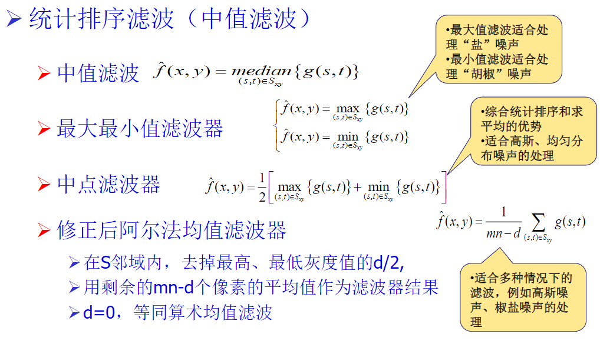

# Summary Notes

## Chapter 2

亮度对比计算公式： $C_r = abs(B-B_0) / B_0 * 100\%$, 式中，B为物体亮度， $B_0%为背景亮度

在均匀照度背景$I$上，有一照度为$I+\Delta I$的光斑，称眼睛刚好能分辨出的照度差$\Delta I$与 $I$ 的比$\frac{\Delta I}{I}$为对比灵敏度；
由于背景亮度 I 增大， △I 也需要增大，因此在相当宽的强度范围内，对比灵敏度是一个常数，约等于0.02，这个比
值称为韦伯比(Weber比)

**马赫带效应（Mach band effect）** 指的是一种主观的边缘对比效应。当观察两块亮度不同的区域时，边界处亮度对比加强。

**侧抑制效应**：视觉信号并不是单纯由一个视觉细胞感觉产生的，而是由相邻视觉细胞信号加权和形成的

用光函数$C(x,y,t,\lambda)$表示可见光， C为一连续函数。x,y为空间分布(坐标)；t为时间分布；$\lambda$为波长
人眼及各种传感器接受到的图像信息为：
$$F_i(x,y,t) = \int C(x,y,t,\lambda)S_i(\lambda)d\lambda$$
其中$F_i(x,y,t)$为第i个传感器的输出, $S_i(\lambda)$为第i个传感器的光谱特性

光辐射的能源可用$r(\lambda)$表示；能谱分布$r(\lambda)$ ：辐射源在单位时间内在每一波长间隔上所辐射的能量。辐射功率$P=\int r(\lambda)d\lambda$ ，亦称辐射通量或辐射量，单位为瓦

**光通量**：光源以电磁波的形式辐射出的光功率，称为光通量；单位为流明$lm$

图像一般是对目标上的照度成分$i$和反射成分$r$进行度量得出的
$$f(x,y)=i(x,y)\times r(x,y)$$
其中$f(x,y)$为图像在该点的亮度值，或灰度级

**像素的邻域：**

- 4-邻域 $N_4(p)$
- 对角邻域 $N_D(p)$
- 8-邻域 $N_8(p)$

两个像素是否连接：

1. 是否接触（近邻像素）
2. 灰度值是否满足某个特定的相似规则

3种链接：

1. 4-连接：2个象素 $p$ 和 $r$ 在$V$中取值且$r$在$N_4(p)$中
2. 8-连接：2个象素 $p$ 和 $r$ 在$V$中取值且$r$在$N_8(p)$中
3. m-连接（混合连接）：2个象素$p$ 和 $r$ 在$V$中取值，且满足下列条件之一：
    - $r$在$N_4(p)$中
    - $r$在$N_D(p)$中且$N_4(p) \cap N_4(r)$是空集

**距离量度函数:**

- 欧式(Euclidean)距离 $D_e(p,q) = \sqrt{(x-s)^2 +(y-t)^2} $
- 城区(city-block)距离 $D_s(p,q) = |x-s| + |y-t|$
- 棋盘(chessboard)距离 $D_g(p,q) = max(|x-s|, |y-t|)$

## Chapter 3

### 直接灰度变换

规范化(normalization)
规范化是将原动态范围从$f_{min}－f_{max}改变成0-255。也即进行线性变换，将动态范围扩大。公
式如下：
$$g(x,y)=\frac{f(x,y) - f_{min}}{f_{max}-f_{min}}\times 255$$

压缩动态范围
$$g=clog(1+f)$$
其中$c$为常数，使得$g$范围为$0-255$

### 直方图

**直方图均衡**

**直方图规定化**

直方图均衡化： 自动增强

- 效果不易控制
- 总得到全图增强的结果

直方图规定化： 有选择地增强

- 须给定需要的直方图
- 可特定增强的结果

### 图像间运算

1. 去除噪声-利用多幅图像相加（假设：噪声在空间位置上互不相关）
2. 差异检测-利用多幅图像相减（要求：多幅图像之间位置准确对应）
3. 区域选择-利用多幅图像相乘（逻辑运算，制作感兴趣区域为1的掩膜图像）

### 空域滤波

平滑的主要目标是去除噪声，附加要求是保护图像信息的细节
分类1：

1. 线性：如邻域平均
2.非线性：如中值滤波

分类2：

1. 平滑：模糊，消除噪声
2. 锐化：增强被模糊的细节

滤波器实现方法——— 邻域加权运算
所谓“掩模”就是一个窗口，作为象素变换的模板，并表示了变换关系。掩模本身就是空间滤波器。
$$R=k_0s_0 + k_1s_1 + \dots + k_8s_8$$
对于图象中的任何一点，将掩模放在该位置上，则该点进行变化之后将由新值R代替
掩模计算的过程，也就是数学上离散卷积的过程
$$g(m,n)=f(m,n)*h(m,n)$$
其中：f(x,y)为原图， h(x,y)为处理模板， g(x,y)为滤波结果
低通滤波器：可以减弱噪声，使图更平滑，但同时降低图象的清晰度
高通滤波器：使得图中的边缘和细节更清晰，但噪声也随之被强化

### 平滑滤波器

#### 线性平滑滤波器(G1)

- 系数都是正的（中心系数大，周围系数小）
- 保持灰度值范围（所有系数之和为1）
$$z=\frac{1}{M}\sum_{i=0}^{M-1}k_is_i$$

**带门限的邻域平均:**

思想：有噪声就进行邻域平均去噪，无噪声不处理
被处理像素的灰度与邻域均值的差别不大，认为噪声不存在，或可以容忍，不作处理；反之用邻域均值取代原像素灰度
$$
g(m,n) =
\begin{cases}
\frac{1}{N} \sum\limits_{(i,j)\in S} f(i,j), & \left| f(m,n) - \frac{1}{N} \sum\limits_{(i,j)\in S} f(i,j) \right| > T \\
f(m,n), & \text{otherwise}
\end{cases}
$$

**半邻域平均：**
思想：判断邻域中有无边缘，没有边缘，可以不担心细节信息被平滑，被处理像素灰度采用全邻域均值；否则，根据邻域中的目标信息为被处理像素赋值
邻域中8个邻点像素分为2组，灰度值小的3个A组，其他B组， 两组之间灰度差别大，认为有边缘，否则无边缘
算法：

1. 对P点的邻点$A_i$灰度排序，分为A、B两组
2. 计算A组均值$M_3$，B组加P点均值$M_6$和全邻域均值$N$
3. 根据预设门限T，被处理像素的新灰度为

$$
g(m,n) =
\begin{cases}
N, & \left| M_6 - M_3 \right| \leq T \\
M_6, & \left| M_6 - M_3 \right| > T
\end{cases}
$$

#### 非线性平滑滤波器（G2）-统计排序滤波

邻点平均滤波有损于图的清晰度。**中值滤波器**可做到只去除噪声而不使原图清晰度变坏
原理：将一个窗置于感兴趣点之上，将窗中所有邻点灰度值排序，变换后在该感兴趣点上的灰度值将由邻点排序后的中值代替

**多窗口中值滤波器：**

1. 计算以P(x,y)为中心的3X3十字形窗口内像素的中值
2. 计算以P(x,y)为中心的3X3X字形窗口内像素的中值
3. 计算9点平均
4. 计算差值

$$
\Delta_1 = md_1 - P(m,n)\\
\Delta_2 = md_2 - P(m,n)\\
\Delta_3 = P(m,n) - av
$$

5. 处理后像素的新值

$$
g(m,n) =
\begin{cases}
md_1, & \Delta_1 = \Delta_2 \\
\max(md_1, md_2), & \Delta_1 \neq \Delta_2, \Delta_3 \geq 0 \\
\min(md_1, md_2), & \Delta_1 \neq \Delta_2, \Delta_3 < 0
\end{cases}
$$

### 锐化滤波器

减弱或消除低频分量，保留高频分量，又称高通滤波器. 把低通滤波器的概念用到高通中来。如果从图象中除去低频分量剩下的就是高频分量了，即高通＝原图－低通

#### 线性锐化滤波器(G3)

- 中心系数为正，周围系数为负
- 输出平均值为零

$$
\frac{1}{9}
\begin{bmatrix}
-1 & -1 & -1 \\
-1 & 8  & -1 \\
-1 & -1 & -1
\end{bmatrix}
$$

**高频提升:**

- 如果把高通滤波的结果加到原图乘以一个系数后的图中去，其结果是原图中的低频信号没有完全除去，高频信号有了一定程度的增加。因而称为高频提升
- 高频提升＝参数×原图＋高通
- 如果参数＝0就还原成高通。如果＞0，则部分低频保留而高频得到了加强

#### 非线性锐化滤波器(G4)

- 邻点平均的滤波效果使图象模糊。它是邻点灰度值相加的结果，可类比为积分，那么可以期待求邻点差分－微分将产生正好相反的效果
- 最常见的微分方法是求梯度，因而微商滤波器也经常就是梯度滤波器

典型梯度模板

## chapter 4

2-d离散傅里叶变换
$$
F(u,v) = \frac{1}{N}\sum_{x=0}^{N-1}\sum_{y=0}^{N-1}f(x,y)exp(-j2\pi(ux+vy)/N)\\
f(x,y) = \frac{1}{N}\sum_{u=0}^{N-1}\sum_{v=0}^{N-1}F(u,v)exp(j2\pi(ux+vy)/N)
$$

**周期序列的卷积-不重叠的条件:**

- f(x)和g(x)的周期为M，卷积后的周期还是M
- f(x)和g(x)为在周期内有限长序列，各自的非0值序列长度分别为A和B，只有在, $M \ge A+B-1$时，卷积结果才不会重叠

2-D离散傅里叶变换的特别说明：

- 基本性质: 线性、尺度、时移、平移、旋转
- 频域函数实部是u,v的偶函数，虚部是u,v的奇函数
- 频域幅频特性是u,v的偶函数，相频特性是u,v的奇函数
- $|F(u,v)|$低频在频域图像左上端F(0,0)
- $F(u,v)|$高频在频域图像最中间$F(M/2,N/2)$

**频域滤波步骤：**

1. 输入图f(x,y)乘(-1)^x+y 使变换原点为中心
2. 计算f(x,y) 的FFT， F(u,v)
3. 计算G(u,v)=F(u,v) ×H(u,v)，进行滤波
4. 计算G(u,v) 的IFFT g(x,y)
5. 取得g(x,y)的实部
6. 结果乘(-1)^(x+y)变回原来的形状

### 低通滤波

#### 理想低通滤波器

如果$D_0$是一个正数，$D(u,v)$是到原点的距离，那么满足下列关系的滤波器为理想低通滤波器
$$
H(u,v) =
\begin{cases}
1 & \text{if } D(u,v) \leq D_0 \\
0 & \text{if } D(u,v) > D_0
\end{cases}
$$
此时$D_0$为截止频率

#### Butterworth低通滤波器

减少振铃效应，高低频率间的过渡比较光滑
$n$阶、截止频率为$D_0$的Butterworth低通滤波器的传输函数定义为
$$
H(u,v) = \frac{1}{1+(\sqrt{2}-1)(D(u,v)/D_0)^{2n}}
$$
其中$D(u,v)$为半径

#### Gaussian低通滤波器

高斯函数的形状是钟形曲线，它的特点是在频域中心（即低频部分）值最大，然后随着离中心频率越远，值逐渐减小。这样就保证了低频信号成分通过，而高频信号成分被衰减。
系统函数：
$$
H(u,v) = e^{-\frac{D(u,v)^2}{2D_0^2}}
$$

### 高通滤波

高通滤波是想保留图象中灰度急剧变化的部分，一般只讨论零相移高通滤波器

#### Butterworth高通滤波器

减少振铃效应，高低频率间的过渡比较光滑
$n$阶、截止频率为$D_0$的Butterworth高通滤波器的传输函数定义为
$$
H(u,v) = 1 - \frac{1}{1+(\sqrt{2}-1)(D(u,v)/D_0)^{2n}}
$$
其中$D(u,v)$为半径

### 带通阻滤波

**带阻滤波器：**

- 阻止一定频率信号（允许其它频率范围信号）
- 旋转对称

$$
H(u,v) =
\begin{cases}
1 & \text{if } D(u,v) < D_0 - \frac{W}{2} \\
0 & \text{if } D_0 - \frac{W}{2} \leq D(u,v) \leq D_0 + \frac{W}{2} \\
1 & \text{if } D(u,v) > D_0 + \frac{W}{2}
\end{cases}
$$

$$
H(u,v) = \frac{1}{1 + \left[\frac{D(u,v)W}{D^2(u,v) - D_0^2}\right]^{2n}}
$$

**带通滤波器：**

- 与带阻滤波器互补，允许一定频率信号（阻止其它频率信号）
- 旋转对称

$$
H(u,v) =
\begin{cases}
0 & \text{if } D(u,v) < D_0 - \frac{W}{2} \\
1 & \text{if } D_0 - \frac{W}{2} \leq D(u,v) \leq D_0 + \frac{W}{2} \\
0 & \text{if } D(u,v) > D_0 + \frac{W}{2}
\end{cases}
$$

$$
H(u,v) = \frac{1}{\left[ \frac{D^2(u,v) - D_0^2}{D(u,v)W} \right]^{2n} + 1}
$$

### 同态滤波

同态滤波是在频域中同时压缩动态范围并增强局部对比度，来实现图象增强的方法
先进行对数运算，然后再进行线性运算，最后以指运算结束，称之为乘法同态系统。用这类系统进行滤波叫同态滤波。其中取对数的目的使信号满足线性系统的要求，取指数使其变回来

### 局部增强

- 实际应用中常常需要对图象某些局部区域的细节进行增强
- 局部增强方法比全局增强方法在具体进行增强操作前多了一个选择/确定局部区域的步骤
利用每个象素邻域内象素的均值和方差：
$$g(x,y) = A(x,y)*[f(x,y)-m(x,y)] + m(x,y)$$
局部增益函数
$$A(x,y) = k\frac{m(x,y)}{\sigma(x,y)}$$
A (x,y)反比于均方差，与f (x,y)和m (x,y)的差相乘能放大图象的局部变化，对比度较小的区域得到的增益较大

## Chapter 5

### 退化模型

- 光学系统孔径衍射造成的退化
- 目标运动造成的退化
- 成像过程的非线性造成的退化
- 噪声引入造成的退化

退化模型的数学表示
$$g(x,y) = H[f(x,y)] + n(x,y)$$

恢复图象：在给定g(x,y)和代表退化的H的基础上得到对f(x,y)的某个近似

### 噪音

**种类：**

- 高斯噪音 $p(x)=\frac{1}{\sqrt{2}\pi\sigma}exp(-\frac{(x-\mu)^2}{2\sigma^2})$
- 均匀噪音 $p(x)=\frac{1}{b-a} \quad a \le x < b$
- 脉冲（椒盐）噪音

$$
p(x) =
\begin{cases}
P_a & \text{if } x = a \\
P_b & \text{if } x = b \\
0 & \text{otherwise}
\end{cases}
$$

- 周期性噪音
- 瑞丽噪音、指数、伽马

### 空域滤波去噪

### 交互式恢复

退化仅由噪声造成 $G(u,v) = F(u,v) + N(u,v)$
依靠视觉观察在频率域确定出脉冲分量的位置并在该位置利用带阻滤波器消除,在多个正弦分量：在频率域里对应每个亮点的位置放1个带通滤波器$H(u,v)$
干扰模式的傅立叶变换$P(u,v) = H(u,v)G(u,v)$
得到干扰模式的傅立叶变换，在进行反变换，从退化图像减去干扰图像，也能达到恢复的目的

### 几何失真的校正

图象$f(x,y)$受几何形变的影响变成失真图象$g(x', y')$
失真的坐标变换数学描述如下: $x'=s(x,y) y'=t(x,y)$
对于线性失真: $s(x,y) = a_1x+a_2y+a_3$, $t(x,y)=b_1x+b_2y+b_3$

**模型系数的确定：**

- 采用约束对应点方法，也称控制点方法
- 在输入图（失真图）和输出图（校正图）上找一些其位置确切知道的点，然后利用这些点建立两幅图间其它象素空间位置的对应关系
