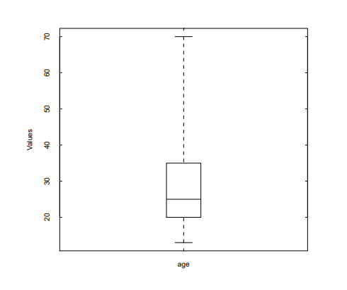

## Homework 2

### 2.2

由题意可知，有如下的数据表格

```json
13  15  16  16  19
20  20  21  22  22
25  25  25  25  30
33  33  35  35  35
35  36  40  45  46
52  70
```

(a) 平均数 $\bar{x}= \frac{1}{n}\sum^n_{i=1} x_i = 809 / 27 = 30$ 中位数(median) 为 $25$

(b) 该数据集有两个以相同最高频率出现的值，因此是二模(bimodal)的; 数据的众数为 25 和 35。

(c) 数据集中的中列数(midrange)是 $(70 + 13) / 2 = 41.5$

(d) 数据集中的第一个四分位数(first quartile) $Q_1 = 20$ 第三个四分位数(thrid quartile) $Q_3 = 35$

(e) 五数概括(five number summary): minimum value, first quartile, median, the third quartile and maximum value, 分别是: $13, 20, 25, 35, 70$

(f) 



(g) 分位数图展示了数据集中不同百分位的数据值，帮助我们理解数据分布的全貌。分位数-分位数图（Q-Q图）则比较两个数据集的分位数，通过绘制点来显示两个数据集在不同百分位上的相对大小。在Q-Q图中，如果加上一条y=x的参考线，位于这条线上的点表示两个数据集在该分位数上的值相等；点在线上方意味着y轴数据集的值在该分位数上高于x轴的数据集，反之则低。Q-Q图简单直观地展示了两个数据集的分布差异。 

### 2.3

| age      | frequency |
| -------- | --------- |
| 1 ~ 5    | 200       |
| 6 ~ 15   | 450       |
| 16 ~ 20  | 300       |
| 21 ~ 50  | 1500      |
| 51 ~ 80  | 700       |
| 81 ~ 110 | 44        |

$$
L1 = 20, n= 3194, (∑
f
)l = 950, freq median = 1500, width = 30, median = 32.94 years.
$$

### 2.5

1. 标称属性：根据不匹配率计算
2. 非对称的二元属性：根据二元属性的列联表计算 
3. 数值属性：使用 Minkowski 距离(Euclidean 距离和 Manhattan 距离的推广) 
4. 词频向量：使用 cos similarity 计算 

### 3.1

准确性：对于一些需要进行精准营销的商品，比如蛋糕店的生日蛋糕、孕妇必备物品等

完整性：如果要对某宝、某东或者某宁的买家信息进行一个数据挖掘，从而用来营销其他东西

一致性问题：由于某些不可抗因素而导致的数据不一致，比如技术问题，在并发量大的情况下，记录数据时出现问题；

数据质量的其他两个尺度：时效性和可信性。

时效性：数据必须在一定时间范围内可用，以便对决策有用。

可信性：数据值必须在可能结果的范围内，以便对决策有用。

### 3.2

处理数据元组中缺少值的问题的各种方法包括：

（a）忽略元组：通常在缺少类标签时执行此操作（假设挖掘任务涉及分类或描述）。除非元组包含缺少值的几个属性，否则此方法不太有效。当每个属性的缺失值的百分比相差很大时，这尤其差劲。

（b）手动填充缺失值：通常，此方法很耗时，对于缺失值很多的大型数据集，这可能不是一个合理的任务，尤其是当填充值不容易确定时。

（c）使用全局常量填充缺失值：用相同的常量替换所有缺失的属性值，例如“ Unknown”或-∞之类的标签。如果将缺失的值替换为“未知”，则挖掘程序可能会错误地认为它们构成了一个有趣的概念，因为它们都具有一个共同的值，即“未知”。因此，尽管此方法很简单，但不建议使用。

（d）将属性均值用于定量（数字）值或将属性模式用于分类（标称）值：例如，假设AllElectronics客户的平均收入为$ 28,000。 使用此值替换任何缺失的收入值。

（e）对于属于与给定元组相同类别的所有样本，使用定量（数值）值的属性均值或分类（名义）值的属性模式：例如，如果根据信用风险对客户进行分类，则替换缺失的 与给定元组处于相同信用风险类别的客户的平均收入值。

（f）使用最可能的值来填补缺失值：这可以通过回归，使用贝叶斯形式主义的基于推理的工具或决策树归纳法来确定。 例如，使用数据集中的其他客户属性，我们可以构建决策树来预测收入的缺失值。

### 3.3

首先，将以上数据划分为深度为 3 的箱：

 (13,15,16)，(16,19,20)，(20,21,22)， (22,25,25)，(25,25,30)，(33,33,35)， (35,35,35)，(36,40,45)，(46,52,70)； 

用箱均值光滑： (14.7,14.7,14.7)，(18.3,18.3,18.3)，(21,21,21)， (24,24,24)，(26.7,26.7,26.7)，(33.7,33.7,33.7)， (35,35,35)，(40.3,40.3,40.3)，(56,56,56)。 

对于给定数据，该方法虽然光滑了噪声数据，但是深度太小，数据的分布特征也被抹 去了，同时会受 outlier 影响。 

可以使用聚类来检测离群点，聚类将类似的值组织为 cluster，落在 cluster 集合外 的值被视为离群点。 

分箱时，还可以使用箱中位数光滑、箱边界光滑；回归，离群点分析 

### 3.4

数据集成涉及将来自多个源的数据组合到一个一致的数据存储中。 在这种集成过程中必须考虑的问题包括：

- 模式集成：必须集成来自不同数据源的元数据，以匹配等效的实际实体。 这称为实体识别问题。
- 处理冗余数据：派生的属性可能是冗余的，不一致的属性命名也可能导致结果数据集中的冗余。 在元组级别可能出现重复，因此需要检测和解决。
- 数据值冲突的检测和解决：表示，缩放或编码上的差异可能导致相同的现实世界实体属性值在要集成的数据源中有所不同。

### 3.5

1. 最小最大规范化： $[new_{min}, new_{max}]$
2. z分数规范化: $[\frac{v_{min} - \bar{A}}{\sigma_A}, \frac{v_{max} - \bar{A}}{\sigma_A}]$
3. z分数规范化,使用绝对偏差而不是标准差: $[\frac{v_{min} - \bar{A}}{\s_A}, \frac{v_{max} - \bar{A}}{\s_A}]$
4. 小数定标规范化 : $(-1.0, 1.0)$

### 3.6

(a) 通过使用最大最小规范化方法，设置$min = 0$ and $max = 1$, 可以计算得到下面的式子
$$
v_i' = \frac{v_i - 200}{ 1000 - 200} (1 - 0) + 0
$$
从得到最大最小规范化数据为

| 0    | 1     | 2    | 3    | 4    |
| ---- | ----- | ---- | ---- | ---- |
| 0    | 0.125 | 0.25 | 0.5  | 1    |

(b) 使用z分数规范化，那么有
$$
v'_i  = \frac{v_i - \bar{A}}{\sigma_A}
$$
其中 $\bar{A} = \frac{1}{5}(200+300+400+600+1000) = 500$, $\sigma_A = \sqrt{\frac{1}{5}(200^2+300^2+400^2+600^+1000^2)} = 282.8$

从而得到z分数规范化的数据为

| 0     | 1      | 2      | 3     | 4    |
| ----- | ------ | ------ | ----- | ---- |
| -1.06 | -0.707 | -0.354 | 0.354 | 1.77 |

(c)

此时相较于(b)我们将用标准差代替方差从而得到
$$
s_A = \frac{1}{5}(|200-500| + |300-500| + ...+|1000-500|) = 240
$$
进而得到

| 0     | 1      | 2      | 3     | 4    |
| ----- | ------ | ------ | ----- | ---- |
| -1.25 | -0.833 | -0.417 | 0.417 | 2.08 |

(d)

而使用小数规范化后得到

| 0    | 1    | 2    | 3    | 4    |
| ---- | ---- | ---- | ---- | ---- |
| 0.2  | 0.3  | 0.4  | 0.6  | 1.0  |

### 3.7

(a)

使用相应的方程，$minA = 13，maxA = 70，new_{minA} = 0，new_{maxA} = 1.0$，然后 $v = 35$ 转换为 $v ′ = 0.39$

(b)

同理使用对应的方程得到$A = 809 / 27 = 29.96$ 并且$\sigma_A = 12.94$ 从而 $v=35$将会转换为$v' = 0.39$

(c)

当使用小数正规化的时候得到 $j = 2$ 那么$v= 35$转化成$v' = 0.35$

(d)

考虑到数据处理，十进制缩放法因保持数据分布不变且易于理解而更受青睐，适合针对特定年龄群体的分析。最小-最大归一化法将来的数据限制在原有的最小和最大值范围内，可能导致新数据“越界”，因此不太合适。而z-得分标准化把数据转换为与平均值的偏差度量，这种转换可能不会使属性对用户的直观性或分析结果的有用性有所增加。 